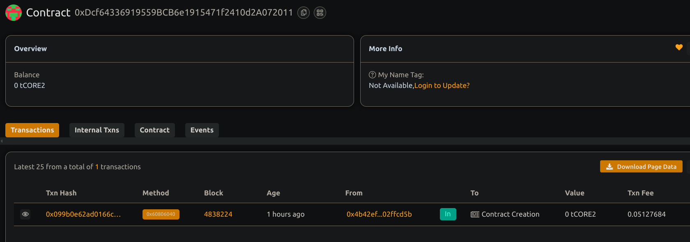

# Decentralized Freelance Platform with Milestone Payment

## 📖 Project Description

This smart contract enables a trustless freelance platform where clients can hire freelancers and pay them securely through milestone-based payments. Each project is broken into multiple deliverables, and funds are released as milestones are completed.

## 🌍 Project Vision

To eliminate intermediaries and ensure transparent, timely payments in the freelance ecosystem by leveraging the power of smart contracts on blockchain.

## 🔑 Key Feature

- Project creation with multiple milestones
- Clients deposit full project funds upfront
- Funds are released to freelancers upon milestone completion
- Cancellation mechanism with refund for unpaid milestones
- Transparent and immutable payment records

## 🚀 Future Scope

- Dispute resolution system
- Rating and review modules
- Integration with decentralized identity (DID)
- Frontend dApp interface for usability
- Support for stablecoins and ERC-20 token payments

## Contract details
0xDcf64336919559BCB6e1915471f2410d2A072011
